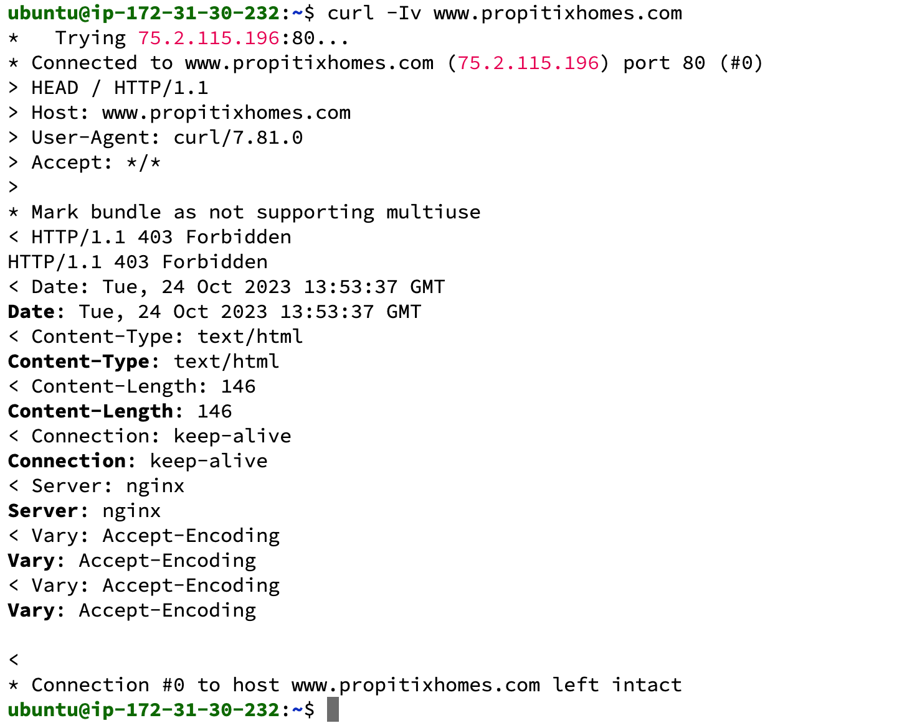
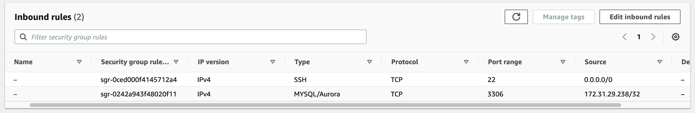
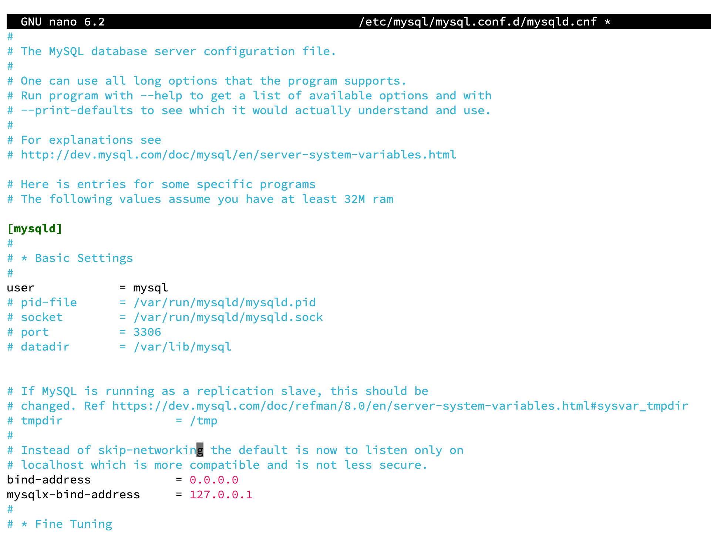

# Understanding Client Server Architecture with MySQL and RDBMS

## Client Server Architecture

The client server architecture refers to a system that hosts, manages and delivers most of the resource that the client requests


### Client Server Architecture with MySQL

We can now add in a DBMS to make our application more robust. The client server architecture refers to an architecuture where two or more computers connected over the internet to make and send requests between one another.

A simple Client Server use case is what we have in the screenshot below.

The client, made a request to the server www.propitixhomes.com and is supposed to get a response

`$curl -Iv www.propitixhomes.com`

Output




# Implementing Client Server Architecture using MySQL DBMS

To demonstrate the Client Server Architecture using MySQL DBMS, create 2 EC2 instances and install MySQL server software on both instances

Server A name - `mysql server` # Install mysql server software 

`sudo apt install mysql-server`

Server B name - `mysql client` # Install mysql client software

After creating the two instances on EC2, on the MySQL-Server do the following settings.

> Add a new Inbound Rule, for MySQL 3306 port and IP of the MySQL-Client server on the MySQL-SERVER instance



We need to configure the MySQL Server to allow connections from Remote Host.

```
sudo nano /etc/mysql/mysql.conf.d/mysqld.cnf 
```

We change the `127.0.0.1` on the bind-address to `0.0.0.0`



It is time to login from the mysql-client side to the MySQL Server

First, you need to create a user on the client side who will be loggin into the server side.

`mysql -u ade -p -h Private_IP_Server` then enter the user password


